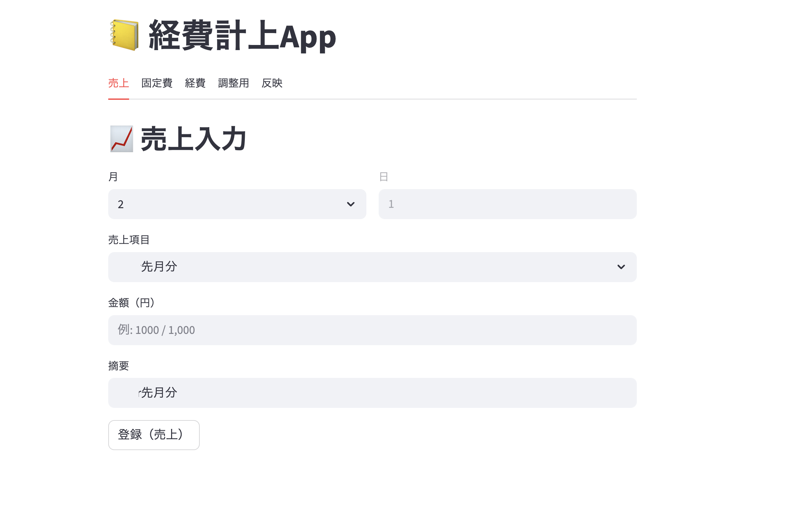
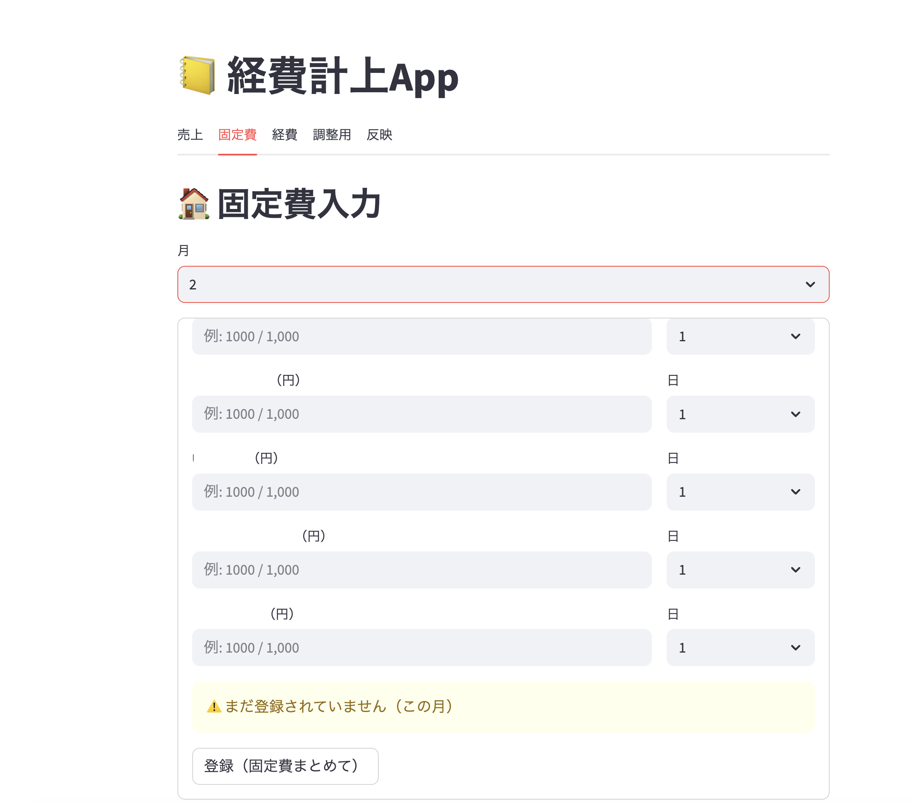
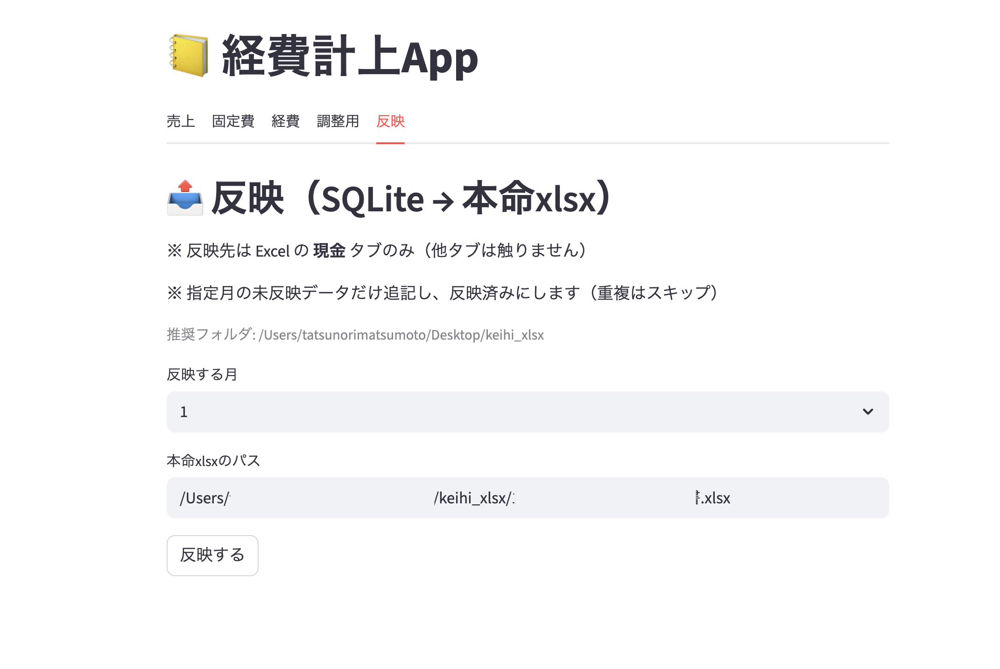

# 📒 keihi-app（経費・売上管理アプリ）

> ✅ 本アプリは実業務で**毎月使用中**です。

軽貨物ドライバー向けに開発した、  
**売上・固定費・経費管理 + 確定申告用Excel自動反映まで一括で行える業務支援アプリ**です。

Streamlit + SQLite + openpyxl で、日々の記帳〜月次管理〜確定申告対応を効率化しています。

---

## 😓 こんな課題を解決しました

- 売上・経費・固定費がバラバラに管理されており、**月末に手動でExcelへ転記**する手間がかかっていた
- 転記ミスや書式崩れで、確定申告前に修正作業が発生していた
- 経費の「ワンクリック登録」ができず、毎回手入力が必要だった
- 青色申告用の決算書Excelを自分で管理するノウハウがなかった

---

## 🚀 主な機能

- 📈 売上入力（月別管理・上書き対応）
- 🏠 固定費管理（月別・自動更新）
- 🧾 経費入力（ワンクリ登録 / 手入力対応）
- 🧩 調整用データ管理（年次まとめ用）
- 📤 Excel自動反映（青色申告決算書対応・書式・並び保持）
- 💾 SQLiteローカル保存（データをローカルで完結管理）
- 🖥 macOSアイコン起動対応（Automator連携）

---

## 🛠 技術構成

| 項目 | 内容 |
|------|------|
| 言語 / UI | Python 3.12 / Streamlit |
| DB | SQLite（ローカル保存）|
| Excel操作 | openpyxl（書式保持・自動反映）|
| 起動 | Automator によるアイコン起動対応 |
| バージョン管理 | Git / GitHub |

---

## 📸 Screenshots

### 📈 売上入力

### 🏠 固定費管理

### 🧾 経費入力

### 🧩 調整用管理

### 📤 Excel反映

---

## 🎯 一言アピール

「確定申告のたびにExcelを手で直すのをやめたい」という課題から開発スタート。  
**青色申告決算書の書式を崩さずに自動反映**する仕組みを実装し、  
月次の記帳から確定申告対応まで、ワンストップで完結できるようになりました。  
**実務で毎月使いながら継続改善している、現場ベースのプロダクトです。**

---

## 👤 Author

たつのり（TEMC）  
軽貨物ドライバー / 個人開発  
🔗 [ここなら](https://coconala.com/users/5901606) ／ [クラウドワークス](https://crowdworks.jp/public/employees/4545609)

---

## 📄 License

This project is for personal and portfolio use.
